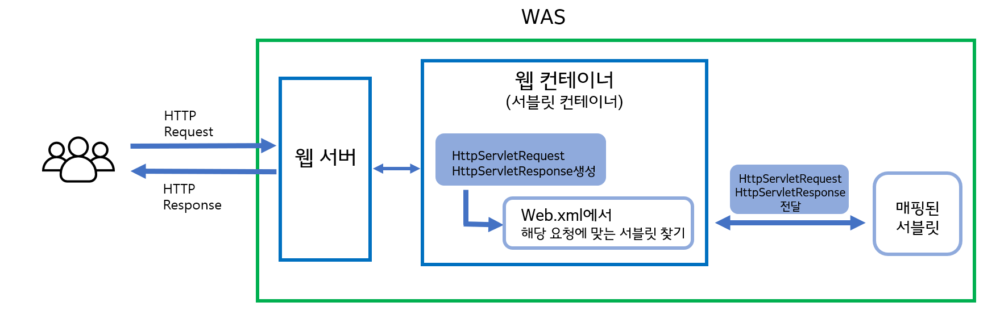

# 서블릿
- 서블릿은 최종 사용자로부터 요청을 수신하고, 응답하는 역할을 한다.
    * 서블릿은 자바 서버 내에서 실행되는 작은 자바 프로그램.
    * 일반적으로 HTTP 를 통해 Client 로 부터 요청을 수신하고 응답한다.
- => 모든 웹 애플리케이션의 핵심 클래스
    * Filter 를 구현하여 중간에 요청을 종료하지 않는 이상 모든 요청을 수신함 

```java
import javax.servlet.http.HttpServlet; // Server + let

public class  Main extends HttpServlet {
    
}
```

- 직접 Servlet 을 구현하여 사용한다면,
- web.xml 
```xml
<servlet>
    <servlet-name>hello</servlet-name>
    <servlet-class>com.Hello</servlet-class>
</servlet>

<servlet-mapping>
    <servlet-name>hello</servlet-name>
    <url-pattern>/hello</url-pattern>
</servlet-mapping>
```


